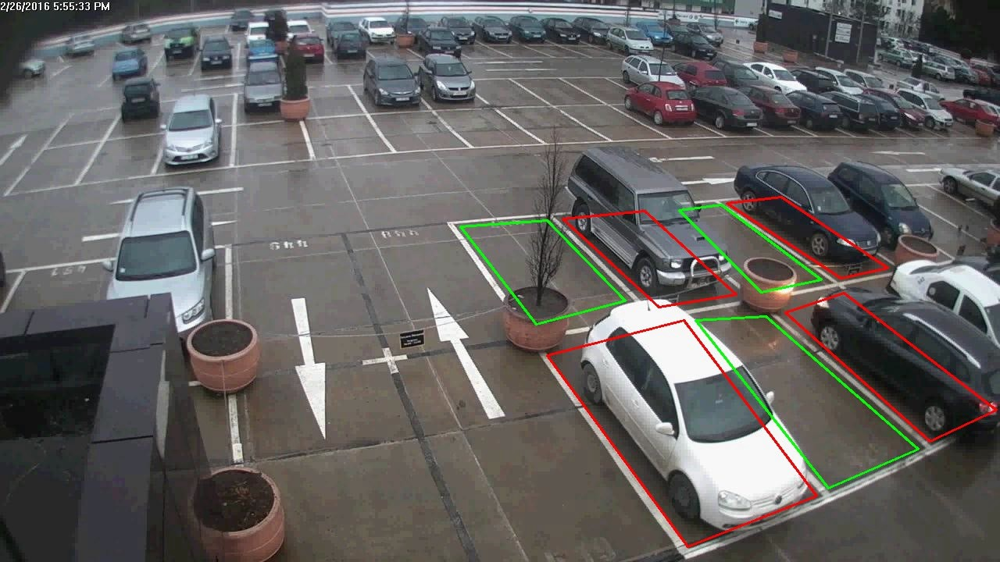

# List of diploma project ideas

**Updated on 12.04.2022 (for 2023)**

General topics: 

 - Applications in signal processing: image / video / audio / etc.
 - Embedded devices for acquisition of signals 
 - **Any topic that the student is interested in**, in the domain of signal processing. Talk to me about it first.

General requirements:
  - abilities and interest in programming: Matlab / Python / any other language
  - general knowledge in Digital Signal Processing

## Sample subjects

Below is a list of possible topics. Any other similar topic is possible, after a discussion.

### AI and neural networks

#### Parking Spotter

Use object detection methods for detecting cars and free parking spots in a large parking area.   
Implement it live on a Raspberry PI or equivalent.

Example:

- https://www.parking-spotter.com/

#### Car Distance Estimator

Use object detection methods for detecting the car in front of you and, based on the size of the car, estimate the distance to it.
Implement it live on a Raspberry PI or equivalent.

#### Traffic Sign Detection

Use AI object detection and classification methods for identification of traffic signs.
Implement it live on a Raspberry PI or equivalent.

### Image/video processing

#### Lane detection

Use image processing algorithms to detect the lanes from a traffic video and understand:

- which line we are currently on
- is there a curve next, or is the road straight

Implement it live on a Raspberry PI or equivalent.

Example:

- https://medium.com/computer-car/udacity-self-driving-car-nanodegree-project-1-finding-lane-lines-9cd6a846c58c

#### Detection of driver fatigue by video analysis

Implement a method of analyzing a video sequence to estimate the degree of fatigue of a driver, by tracking the eyes and mouth in the images (blinking / yawning).

References:

  - https://github.com/piyushbajaj0704/Driver-Sleep-Detection-Face-Eyes-Mouth-Detection

#### Image inpainting using sparse representations
 
Image inpainting means „filling” some missing pixels or parts of an image. 
Implement one of the various methods for this, namely the one based on sparse decompositions of images in the frequency domain.

References:

- https://github.com/ily-R/Image-Inpainting-via-Sparse-Representation

#### Image classification with SVM (or other) algorithms
   
Implement and evaluate an algorithm for image classification, aiming to detect if a person is or is not wearing a mask.

References:

- https://ieeexplore.ieee.org/document/9301079

#### Methods for image denoising
   
Implement and compare a number of methods for reducing the noise in general images or other types of data (based on filtering, different transforms, spline smoothing etc).

Examples:

- http://www.mickaeltits.be/open-image-restoration/

#### Object tracking methods in videos

Implement and evaluate one method of video object tracking. End goal: track cars in a traffic video.

References:

- https://manivannan-ai.medium.com/multiple-object-tracking-algorithms-a01973272e52-

#### Motion estimation with optical flow in videos
   
Implement one or more algorithms for motion estimation with optical flow, in order to estimate the movement direction and speed of objects in a video sequence.

References:

- https://nanonets.com/blog/optical-flow/

### General signal processing with embedded devices

#### System for acquiring and processing ECG signals

Develop a system for acquiring and analyzing a person's ECG signal, based on an ECG sensor integrated with a Raspberry PI device.

References:

- https://www.optimusdigital.ro/en/others/4411-sensor-module-puls-sparkfun-ad8232.html
- https://www.instructables.com/id/Portable-ECG-Machine/
- https://www.researchgate.net/publication/317368775_A_Portable_Real_Time_ECG_Device_for_Arrhythmia_Detection_Using_Raspberry_Pi
